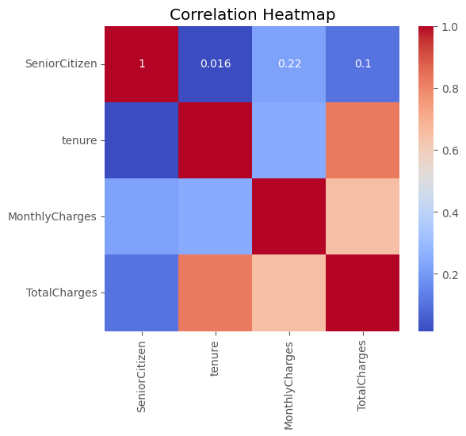
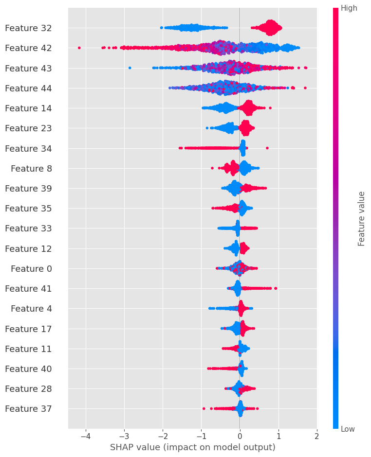
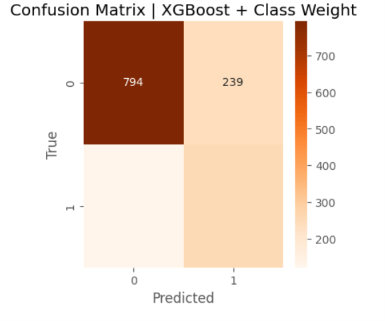

# Customer Churn Prediction for Telecom Company
## Project Overview
Customer churn is a critical problem for telecom businesses. Acquiring new customers costs significantly more than retaining existing ones. This project builds an interpretable machine learning pipeline to predict which customers are likely to churn, using the Telco Customer Churn dataset.

We perform full end-to-end workflow: data cleaning, exploratory data analysis, feature engineering, hyperparameter tuning, model comparison, and model interpretation with SHAP values. The final tuned XGBoost model achieves strong discrimination and gives actionable business insights for customer retention campaigns.

## Dataset
**Telco Customer Churn Dataset**
- Total samples: 1407
- Target variable: `Churn` (1 = customer leaves, 0 = customer stays)
- Imbalanced dataset: only ~26.6% of customers churn
- Features include demographic data, service subscriptions, monthly charges, total charges, and customer tenure.

## Tech Stack
- Python: Pandas, NumPy, Matplotlib, Seaborn
- Machine Learning: Scikit-learn, XGBoost
- Model Interpretation: SHAP
- Hyperparameter Tuning: GridSearchCV
- Version Control: Git & GitHub

## Project Workflow
1. Data Loading & Preprocessing
2. Exploratory Data Analysis (EDA)
3. Feature Engineering & Encoding
4. Train / Test Split
5. Baseline Models: Logistic Regression, Random Forest
6. Hyperparameter Tuning for XGBoost with class weight (`scale_pos_weight`)
7. Model Evaluation using Precision, Recall, F1, ROC-AUC
8. Model Interpretation with SHAP
9. Business Recommendations

## Exploratory Data Analysis (EDA)
### Correlation Heatmap
This heatmap shows pairwise correlation between numeric features: `SeniorCitizen`, `tenure`, `MonthlyCharges`, `TotalCharges`.
Strong positive correlation exists between `tenure` and `TotalCharges`, which makes sense because longer customer tenure accumulates higher total charges.
`MonthlyCharges` and `TotalCharges` also show moderate positive correlation.
`SeniorCitizen` has weak correlation with other features.

## Model Training
### Tuned XGBoost (with scale_pos_weight for class imbalance)
**Best Hyperparameters from Grid Search / Cross Validation:**
- `learning_rate`: 0.1
- `max_depth`: 4
- `n_estimators`: 50

**Cross Validation Result:**
Best CV ROC-AUC: 0.848

**Test Set Result:**
Tuned XGBoost Test ROC-AUC: 0.842

> The small gap between cross-validation AUC and test AUC proves good generalization, no severe overfitting.

## SHAP Analysis
SHAP summary plot explains how each feature impacts the XGBoost churn prediction.
- X-axis: SHAP value, showing positive/negative impact on churn probability.
- Color: Feature value (red = high value, blue = low value).
- Features at the top have the largest influence on model predictions.

SHAP makes the black-box XGBoost model interpretable for non-technical stakeholders.

## Model Evaluation
### XGBoost (Tuned + scale_pos_weight / Class Weight)
| Metric       | Value |
|--------------|-------|
| Accuracy     | 0.74  |
| Precision (Churn=1) | 0.51 |
| Recall (Churn=1)    | 0.67 |
| F1-Score (Churn=1)  | 0.58 |
| Test ROC-AUC      | 0.842 |

> Class 1 = Churners (customers leaving, our target class)
> Recall = 0.67: We can identify 67% of customers who will churn.
> Precision = 0.51: Among all predicted churners, about half will actually leave.

### Confusion Matrix

## Conclusion & Business Recommendations
Grid search was used to tune XGBoost hyperparameters. The tuned model achieved cross-validation ROC-AUC of 0.848 and test ROC-AUC of 0.842, showing good generalization and no heavy overfitting.

SHAP analysis reveals the most influential features driving customer churn decisions. For churners (class 1), recall of 0.67 means we can identify 67% of customers who will leave. This helps the business prioritize retention offers for high-risk customers and reduce attrition.

The lower precision for churners means some predicted churners may remain. Business teams should combine model outputs with customer behaviour data before launching expensive retention campaigns, to avoid wasting marketing budget on customers who would not leave.

### Future Improvements
- Try stacking/ensemble models for better performance
- Add customer segmentation clustering
- Build simple Flask API to serve predictions
- Deploy the model as a web app
